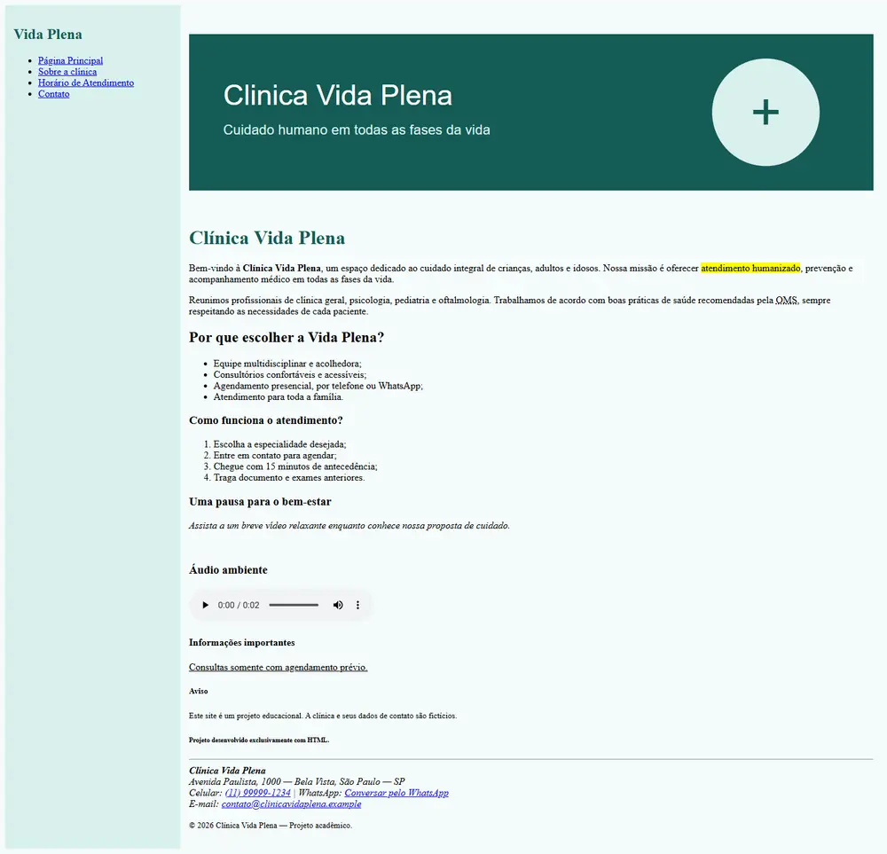
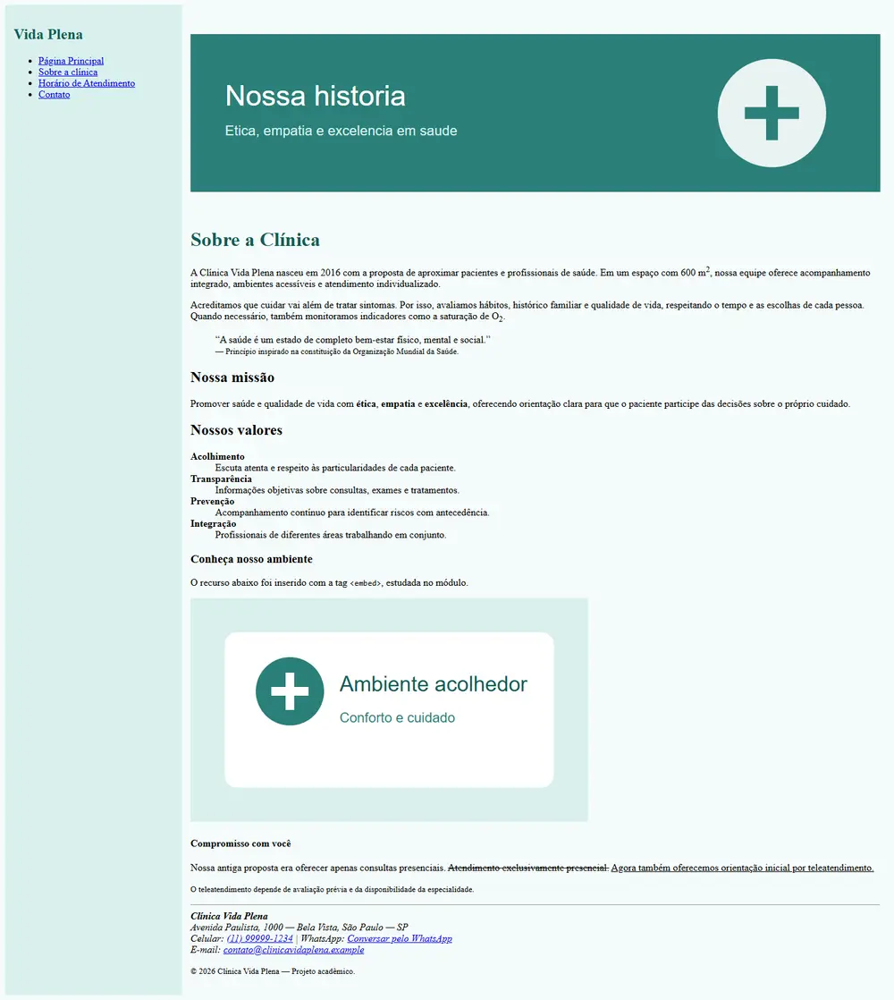
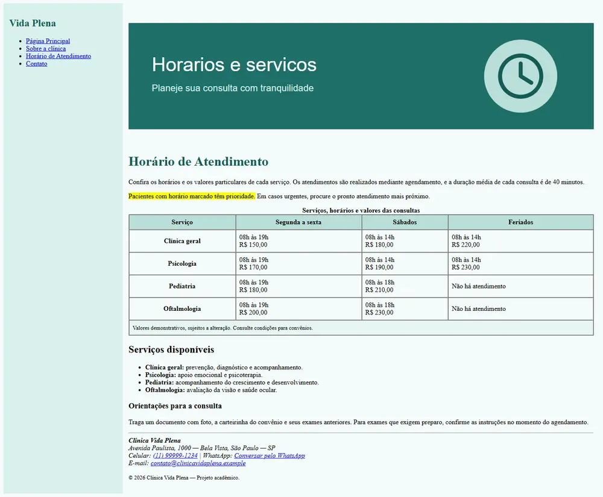
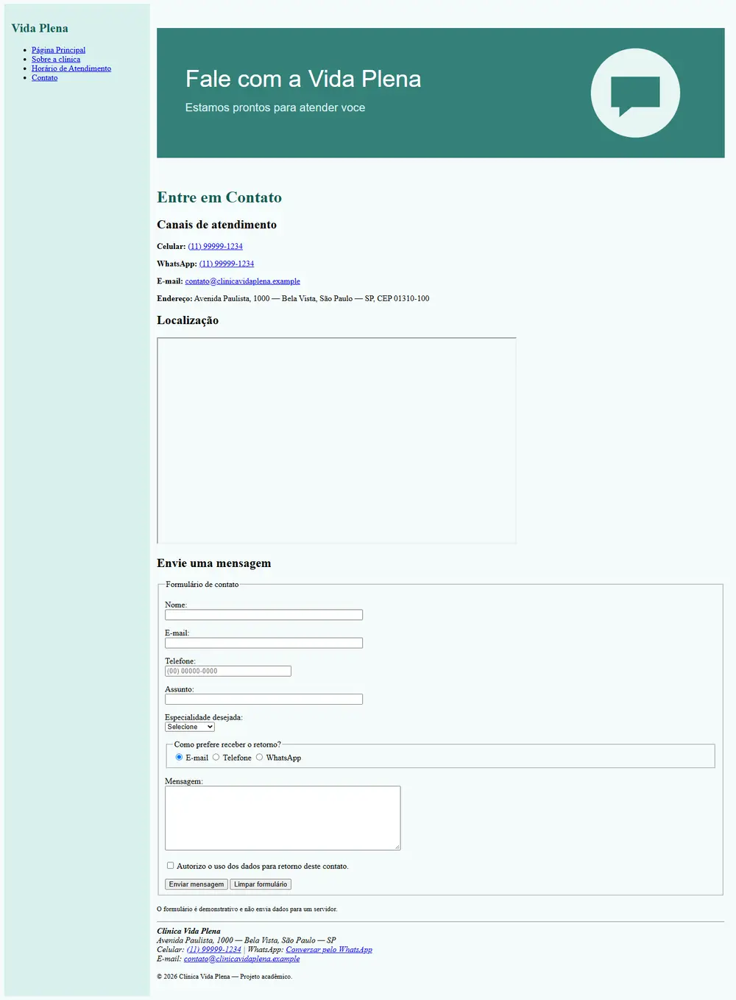

<div align="center">

# 🏥 Clínica Vida Plena

### Site institucional de uma clínica médica desenvolvido exclusivamente com HTML


</div>

---

## 📖 Sobre o projeto

Este projeto foi desenvolvido como parte do **Desafio de Projeto do Módulo 2 da Formação HTML Web Developer da DIO**.

O objetivo foi construir um site quase completo para uma clínica médica, colocando em prática os principais conteúdos estudados no módulo: estruturação e formatação de textos, formulários, mídias, tabelas, navegação entre páginas e incorporação de conteúdo externo.

A **Clínica Vida Plena** é fictícia e foi criada exclusivamente para fins educacionais. O site possui quatro páginas conectadas por um menu de navegação comum e mantém o mesmo padrão de cabeçalho, conteúdo e rodapé.

> 💡 Todo o projeto foi construído com **HTML puro**, sem arquivos CSS e sem JavaScript.

## 🧭 Páginas do site

| Página | Arquivo | Conteúdo |
| --- | --- | --- |
| 🏠 Página Principal | `index.html` | Apresentação da clínica, diferenciais, vídeo e áudio |
| 👩‍⚕️ Sobre a Clínica | `sobre.html` | História, missão, valores e ambiente da clínica |
| 🕐 Horário de Atendimento | `horarios.html` | Serviços, horários e valores organizados em tabela |
| ✉️ Contato | `contato.html` | Telefones, endereço, Google Maps e formulário de contato |

## ✨ Recursos utilizados

- Estrutura completa com `<!DOCTYPE html>`, `<html>`, `<head>` e `<body>`;
- Títulos e textos formatados com diferentes tags HTML;
- Links internos para navegar entre as quatro páginas;
- Listas ordenadas, não ordenadas e listas de descrição;
- Imagens SVG incorporadas diretamente no HTML;
- Elementos de áudio e vídeo com conteúdo alternativo;
- Uso de `<embed>`, `<iframe>` e `<track>`;
- Tabela com `<thead>`, `<tbody>`, `<tfoot>`, `<tr>`, `<th>` e `<td>`;
- Formulário com `<fieldset>`, `<legend>`, `<label>`, `<input>`, `<select>`, `<textarea>` e `<button>`;
- Campos de texto, e-mail, telefone, rádio e caixa de seleção;
- Validação nativa do navegador com o atributo `required`;
- Links para telefone, e-mail e WhatsApp;
- Tags semânticas como `<header>`, `<main>`, `<nav>`, `<footer>` e `<address>`.

## 🖼️ Capturas das telas

### Página Principal

Apresenta a clínica, seus diferenciais, o funcionamento do atendimento e exemplos de mídia.



### Sobre a Clínica

Conta a história da Vida Plena e apresenta sua missão, seus valores e seu compromisso com os pacientes.



### Horário de Atendimento

Exibe os serviços disponíveis, horários de funcionamento e valores demonstrativos em uma tabela completa.



### Contato

Reúne os canais de atendimento, endereço, mapa incorporado e um formulário com validação HTML.



## 📁 Estrutura do projeto

```text
HTML-Clinic-Challenge/
├── index.html
├── sobre.html
├── horarios.html
├── contato.html
├── README.md
└── screenshots/
    ├── pagina-principal.webp
    ├── sobre-a-clinica.webp
    ├── horarios-de-atendimento.webp
    └── contato.webp
```

## 🚀 Como executar

1. Faça o download ou clone este repositório:

```bash
git clone https://github.com/SamuelMonsalvesMoreira/HTML-Clinic-Challenge.git
```

2. Abra a pasta do projeto.
3. Clique duas vezes no arquivo `index.html`.
4. Navegue pelas páginas utilizando o menu lateral.

Não é necessário instalar dependências nem executar um servidor.

## 📝 Observações

- A clínica, os telefones, o endereço, os preços e o e-mail são dados demonstrativos;
- O formulário representa apenas a interface e não envia informações para um servidor;
- O Google Maps e as mídias externas precisam de conexão com a internet;
- Alguns atributos visuais foram aplicados diretamente por HTML para respeitar a proposta do módulo sem CSS.

## 🎯 Aprendizados

Com este projeto foi possível praticar:

- Organização de um site com várias páginas;
- Reutilização do mesmo menu e rodapé;
- Criação de formulários acessíveis;
- Organização de informações em tabelas;
- Incorporação de imagens, áudio, vídeo e mapas;
- Uso de HTML semântico e atributos de acessibilidade.

---

<div align="center">

Desenvolvido por **Samuel Monsalves Moreira** para o desafio da **DIO**.

</div>

